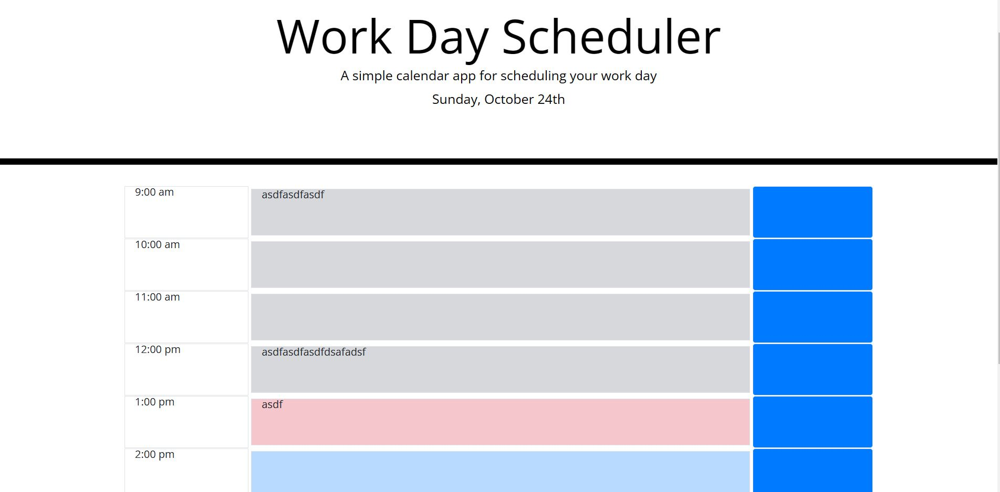

# Work Day Scheduler Starter Code

## Description
This is a work day scheduler that uses JQuery and Bootstrap to accept user input and store it in localStorage.

## Image Mockup

## Link to Site
[Scheduler Link](https://akim47.github.io/WorkDaySchedulerV1/)

## Things to do:
* make IDs unique
* make buttons stand out/more obvious